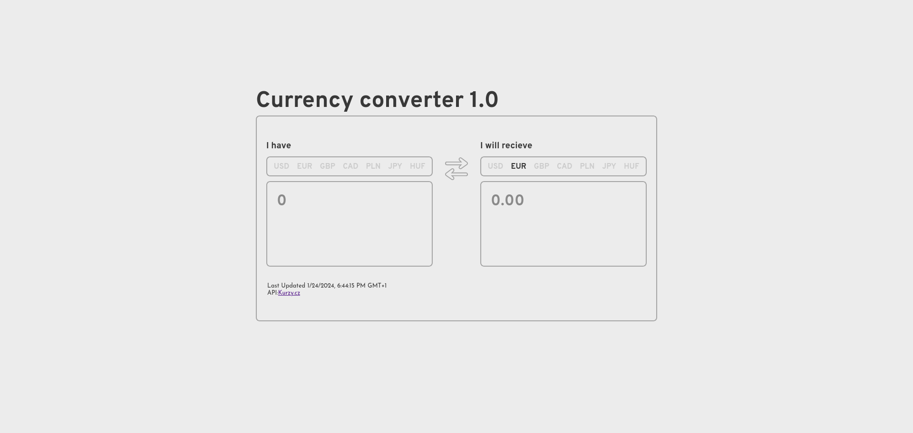
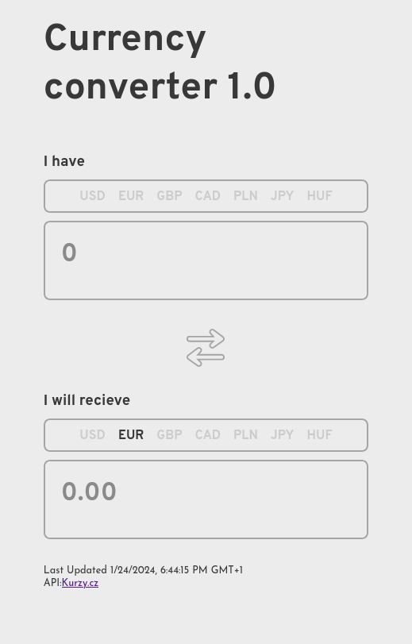

# Currency converter 1.0

## Introduction

Application to convert currency

## Getting Started

Fork this repo and cd to it:

```bash
cd forked-repository
```

Install dependancies by using:

```bash
npm install
```

Run the application:

```bash
npm run dev
```

## Usage

Choose base currency and target currency, then enter number, is that simple!

## Demo

[Link to Live Demo](https://lookatthisdoode.github.io/currency-converter-1-0/)

## Screenshots




## Configuration

You can choose different currencies set inside converter.config.js in root directory

## APIs or External Services

Currencies source is https://www.kurzy.cz/

## Contributing

Please feel free to contribute to the project
